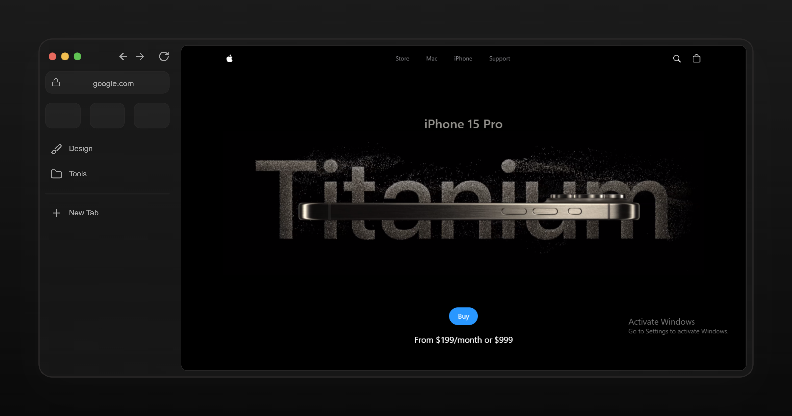
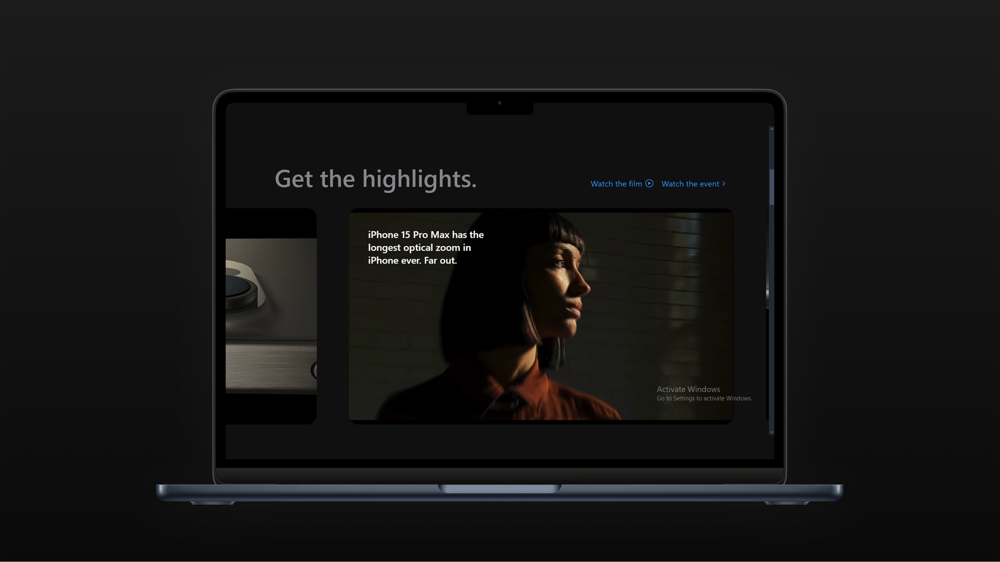
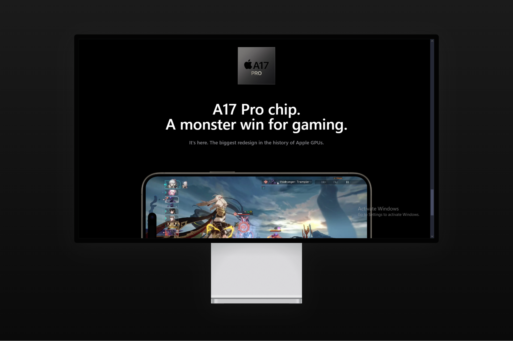
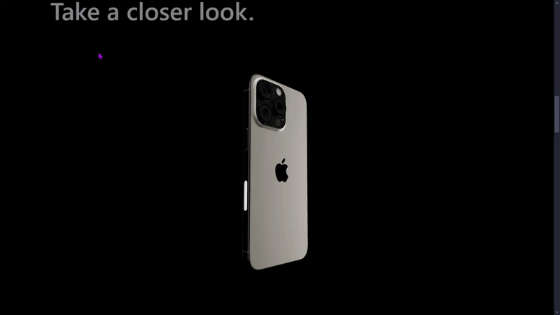

# Apples's iPhone 15 Pro Website
## Introduction
This is a project in cloning the Apples's Iphone 15 Pro website, built using React.js and Tailwind CSS. It makes use of the GSAP (Greensock Animations) and Three.js which is used to display the iPhone 15 Pro models in various colors and shapes.

## 📦 Tech Stack
- React.js
- Three.js
- React Three Fiber
- React Three Drei
- GSAP(Greensock)
- Vite
- Tailwind CSS

## 🧑🏿‍🍳 Features
1. This project has a Beautiful subtle smooth animations using GSAP: The user experience has been enhanced with seamless, wonderful and captivating animations that are being powered by GSAP.

2. This project has a custom video carousel (made with GSAP): This will engage users with a unique and interactive video carousel that is developed with GSAP for a wonderful browsing experience.

3. This project uses 3D Model Rendering with different colors and sizes: This will allow users to explore the iPhone 15 Pro from every angle with a dynamic 3D rendering, that offers various colors and size options

4. This project is also completely responsive it uses consistent access and optimal viewing on any device with a fully responsive design that adapts to different screen sizes.

## ☁️ Process:
1. First, I started by setting up the project with Vite and installing the required dependencies.
2. Then, I created the basic structure of the website using React.js and Tailwind CSS.
3. Next, I implemented the GSAP animations and the custom video carousel.
4. After that, I integrated the Three.js library to render the 3D models of the
iPhone 15 Pro.
5. Finally, I added the custom styles and layouts to make the website visually appealing.
6. I also made sure that the website is fully responsive and works well on different devices.
7. I also made sure that the website is accessible and follows the best practices for web development.
8. I also made sure that the website is SEO friendly and can be easily crawled by search engines
9. I also made sure that the website is secure and follows the best practices for web security.
10. I also made sure that the website is maintainable and can be easily updated and modified in
the future.
11. I also made sure that the website is scalable and can handle a large number of users.

## 📚 Learnings:
1. I learned how to use GSAP to create smooth and seamless animations.
2. I learned how to use Three.js to render 3D models.
3. I learned how to use React Three Fiber and React Three Drei to integrate Three.js with
React.
4. I learned how to setup sentry and the importance of how it performs 

### Setting up sentry:
1. First, you need to install the sentry-cli package globally on your system.
2. Then, you need to create a new project on the sentry dashboard.
3. After that, you need to initialize the sentry-cli package in your project.
4. Next, you need to configure the sentry-cli package to send errors to the sentry
dashboard.
5. Finally, you need to start the sentry-cli package in your project.
6. You can also use the sentry-cli package to send custom events to the sentry
dashboard.
7. You can also use the sentry-cli package to get the current user's session
information.
8. You can also use the sentry-cli package to get the current user's
environment information.
9. You can also use the sentry-cli package to get the current user's
browser information.
10. You can also use the sentry-cli package to get the current user's
device information.

## ✨ Improvements:
1. I would improve the website by adding more features and functionality.
2. I would improve the website by making it more interactive and engaging.
3. I would improve the website by making it more responsive and accessible.
4. I would improve the website by making it more secure and maintainable.


## 🚦 Running the project:
1. First, you need to clone the project from the GitHub repository:
   ```bash
   git clone https://github.com/Lawani-EJ/15ProLandingPage
   ```
2. Navigate to the project directory:
   ```bash
   cd AppleIphonePro
   ```
3. Install the project dependencies using `npm`:
   ```bash
   npm install
   ```
4. Start the development server:
   ```bash
   npm run dev
   ```
   This will start the Vite development server, and the project will be available at a local address (e.g., `http://localhost:5173`).

5. Open your browser and visit the URL displayed in the terminal to view the application.

6. To build the project for production, use:
   ```bash
   npm run build
   ```
   This will generate optimized static assets in the `dist` folder.

7. To preview the production build locally, use:
   ```bash
   npm run preview
   ```
   This is useful to test how the application works in a production-like environment.

---

## 📷 3D Preview and Screenshots 






## 📺 YouTube Credit and Reference  
For additional insights, tips, and tutorials that helped shape this project, check out the YouTube channel referenced below:  

- **Channel Name**: JavaScript Mastery.  
- **Video Title**: Build and Deploy an Apple Website with React | Beginner Three.js & GSAP Tutorial  
- **Link**: [Build and Deploy an Apple Website with React](https://youtu.be/kRQbRAJ4-Fs?si=Pig1Uh6s5ONej0VF)  

I would love to give a special thanks to adrianhajdin for this detailed explanation and guidance, which greatly contributed to the success of this project!  

---
